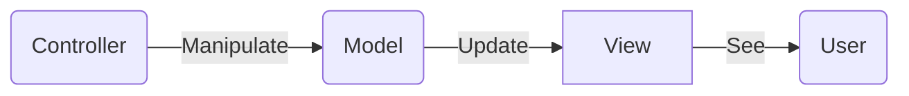

# api.vivakr.com

1. New controller & models
2. Asynchronous implementations with async/await
3. Data-Transfer-Objects(DTOs)
4. Best practices
5. Model-View-Controller (MVC) pattern

```bash
    dotnet watch run
```

## Git

```bash
    # Create -> .gitignore command
    dotnet new gitignore
```


## Model

1. Create Folder `root/Models`
2. 

## View

## Controller


