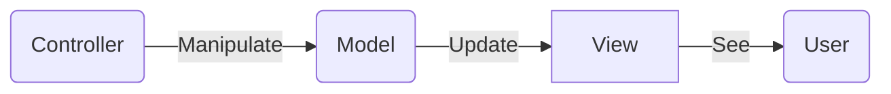
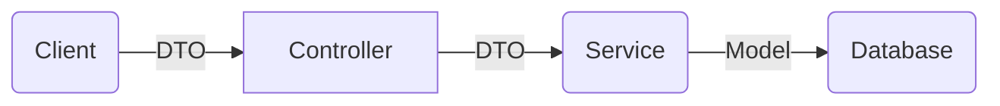

# api.vivakr.com

## Agenda

1. New controller & models
2. Asynchronous implementations with async/await
3. Data-Transfer-Objects(DTOs)
4. Best practices
5. Model-View-Controller (MVC) pattern

```bash
    dotnet watch run
```

## Git

```bash
    # Create -> .gitignore command
    dotnet new gitignore
```

## Model

- Create Folder `root/Models`
- 데이터베이스 테이블의 표현, 정확히 일치

## DTO (Data-Transfer-Objec)

```bash
    dotnet add package AutoMapper.Extensions.Microsoft.DependencyInjection
```

## View

## Controller

## Services 

- Create Folder `root/Services`


- `root/Controllers`


---

## Web API Structure



---

## HTTP Request Methods

- GET : Requests a representation of the specified resource.
- POST : Used to submit an entity to the specified resource, often causing a change in state or side effects on th server.
- PUT : Replaces all current representations fo the target resource with the request palyload.
- DELETE : deletes the specified resource.


